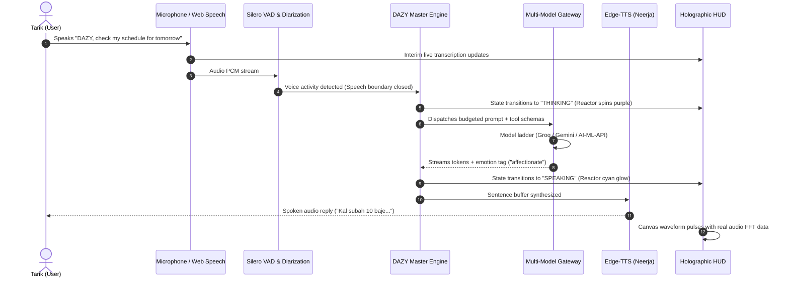
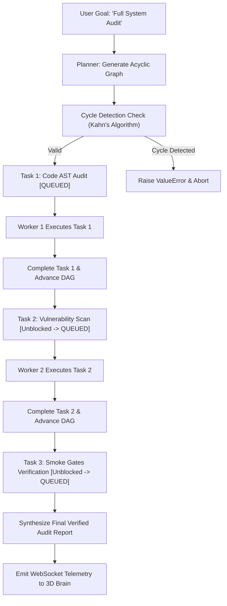
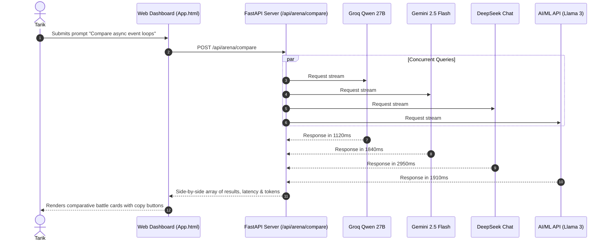

# System Data Flows & Interaction Sequences

---

## 1. Real-time Conversational Voice Pipeline

```mermaid
sequenceDiagram
    autonumber
    actor Tarik as Tarik (User)
    participant Mic as Microphone / Web Speech
    participant VAD as Silero VAD & Diarization
    participant Core as DAZY Master Engine
    participant Router as Multi-Model Gateway
    participant TTS as Edge-TTS (Neerja)
    participant UI as Holographic HUD

    Tarik->>Mic: Speaks "DAZY, check my schedule for tomorrow"
    Mic->>UI: Interim live transcription updates
    Mic->>VAD: Audio PCM stream
    VAD->>Core: Voice activity detected (Speech boundary closed)
    Core->>UI: State transitions to "THINKING" (Reactor spins purple)
    Core->>Router: Dispatches budgeted prompt + tool schemas
    Router->>Router: Model ladder (Groq / Gemini / AI-ML-API)
    Router-->>Core: Streams tokens + emotion tag ("affectionate")
    Core->>UI: State transitions to "SPEAKING" (Reactor cyan glow)
    Core->>TTS: Sentence buffer synthesized
    TTS-->>Tarik: Spoken audio reply ("Kal subah 10 baje...")
    UI->>UI: Canvas waveform pulses with real audio FFT data
```

---

## 2. GodMode-Team DAG Task Execution

```mermaid
flowchart TD
    A["User Goal: 'Full System Audit'"] --> B["Planner: Generate Acyclic Graph"]
    B --> C["Cycle Detection Check (Kahn's Algorithm)"]
    C -->|Valid| D["Task 1: Code AST Audit [QUEUED]"]
    C -->|Cycle Detected| ERR["Raise ValueError & Abort"]
    D --> E["Worker 1 Executes Task 1"]
    E --> F["Complete Task 1 & Advance DAG"]
    F --> G["Task 2: Vulnerability Scan [Unblocked -> QUEUED]"]
    G --> H["Worker 2 Executes Task 2"]
    H --> I["Complete Task 2 & Advance DAG"]
    I --> J["Task 3: Smoke Gates Verification [Unblocked -> QUEUED]"]
    J --> K["Synthesize Final Verified Audit Report"]
    K --> L["Emit WebSocket Telemetry to 3D Brain"]
```

---

## 3. smol-ai Multi-AI Arena Parallel Battle

```mermaid
sequenceDiagram
    autonumber
    actor User as Tarik
    participant Dashboard as Web Dashboard (App.html)
    participant Server as FastAPI Server (/api/arena/compare)
    participant Groq as Groq Qwen 27B
    participant Gemini as Gemini 2.5 Flash
    participant DeepSeek as DeepSeek Chat
    participant AIML as AI/ML API (Llama 3)

    User->>Dashboard: Submits prompt "Compare async event loops"
    Dashboard->>Server: POST /api/arena/compare
    par Concurrent Queries
        Server->>Groq: Request stream
        Server->>Gemini: Request stream
        Server->>DeepSeek: Request stream
        Server->>AIML: Request stream
    end
    Groq-->>Server: Response in 1120ms
    Gemini-->>Server: Response in 1840ms
    DeepSeek-->>Server: Response in 2950ms
    AIML-->>Server: Response in 1910ms
    Server-->>Dashboard: Side-by-side array of results, latency & tokens
    Dashboard-->>User: Renders comparative battle cards with copy buttons
```
